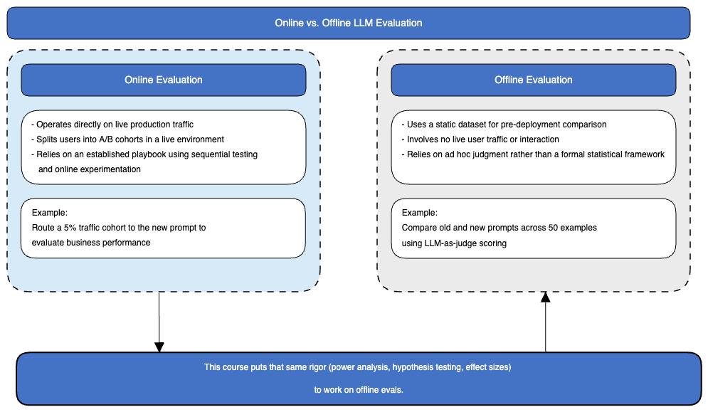
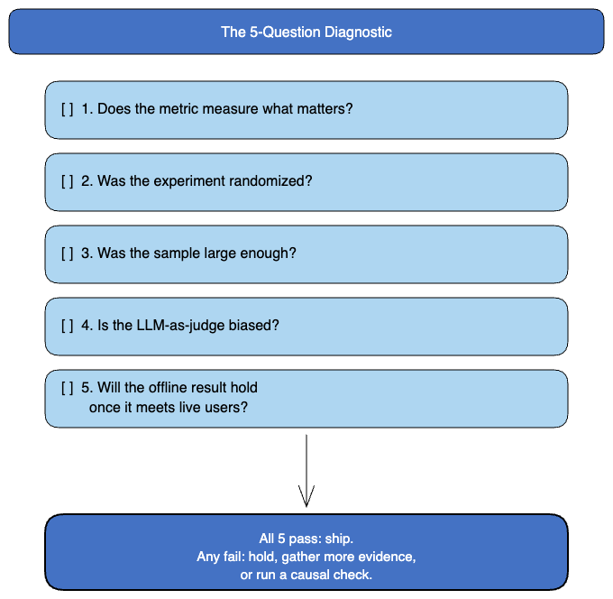

# Statistical Testing for LLM Evaluations

*Design experiments that catch the improvements worth shipping*

Companion notebooks for the O'Reilly live course **Statistical Testing for LLM Evaluations**, taught by **Rudrendu Paul**.

Your LLM eval says the new version is better. Should you trust it? Most LLM evaluations are underpowered, run the wrong statistical test, or measure a metric that does not survive production. These four notebooks give you the statistical toolkit to catch those failures before you ship. Every notebook runs on synthetic data, so `pip install` is the only setup required.

---

## Online vs. offline evaluation

Online evaluation, A/B testing on live traffic, carries a statistical playbook: sequential testing, online controlled experiments, established practice. Offline evaluation, the fixed-dataset comparison you run before anything ships, usually does not. This course closes that gap.



Every notebook in this repo runs an offline comparison: a fixed dataset, no live users, old vs. new prompt or model compared side by side. The statistical toolkit here (power analysis, hypothesis testing, effect sizes) is what online experimentation carries and offline evals typically skip.

---

## Notebooks

| # | Notebook | What it shows | Open in Colab |
|---|----------|---------------|---------------|
| 01 | [Power analysis for LLM evals](notebooks/01-power-analysis-llm-evals.ipynb) | Why 50 examples is statistical vapor. Detecting a 5-point faithfulness gain on a noisy 0-100 judge score needs 847 examples per arm, not 50. Sizing for binary, ordinal, and judge-based metrics. | [](https://colab.research.google.com/github/RudrenduPaul/llm-evals-course/blob/main/notebooks/01-power-analysis-llm-evals.ipynb) |
| 02 | [Hypothesis testing for LLM metrics](notebooks/02-hypothesis-testing-llm-metrics.ipynb) | The same paired data where a t-test says "no difference" (p=0.10) but Wilcoxon catches the improvement the t-test misses (p=0.0078). Mann-Whitney, bootstrap CIs, and the multiple-comparisons trap. | [](https://colab.research.google.com/github/RudrenduPaul/llm-evals-course/blob/main/notebooks/02-hypothesis-testing-llm-metrics.ipynb) |
| 03 | [RAG evaluation case study](notebooks/03-rag-evaluation-case-study.ipynb) | A 14-point retrieval-recall collapse (0.82 to 0.68) hiding behind a steady end-to-end score, and the component-level design that surfaces it. | [](https://colab.research.google.com/github/RudrenduPaul/llm-evals-course/blob/main/notebooks/03-rag-evaluation-case-study.ipynb) |
| 04 | [Agent evaluation mini-case](notebooks/04-agent-evaluation-mini-case.ipynb) *(bonus)* | Agent A wins the benchmark (0.845) but collapses under production constraints (0.705) while Agent B holds steady (0.795) and overtakes it. Multi-level and production-constraint evaluation. | [](https://colab.research.google.com/github/RudrenduPaul/llm-evals-course/blob/main/notebooks/04-agent-evaluation-mini-case.ipynb) |

> **Notebook 04 is a bonus.** The live course covers power analysis, hypothesis testing, and the RAG case in 60 minutes. The agent mini-case is an optional deep-dive to explore on your own.

> **Open in Colab:** click any badge to launch the notebook in Google Colab (no local setup). You can also download the `.ipynb` and upload it to Colab, or run it locally.

All notebooks ship with their outputs saved, so you can read the charts and tables without running a single cell.

---

## Run locally

```bash
git clone https://github.com/RudrenduPaul/llm-evals-course.git
cd llm-evals-course
python -m venv .venv && source .venv/bin/activate   # optional
pip install -r requirements.txt
jupyter lab
```

Python 3.10+ is recommended. No API keys are required. All data is synthetic and generated inside each notebook.

---

## 5-Question Diagnostic Framework

Before you act on any eval result, run it through five questions. The one-page version is in [`5-question-diagnostic-framework.md`](5-question-diagnostic-framework.md).



1. Does the metric measure what matters in production?
2. Was the comparison randomized, or are you reading a confound?
3. Was the sample large enough to detect the effect you care about?
4. Is the LLM-as-judge unbiased by position, length, or model family?
5. Will the offline result hold once it meets live users, production latency, and drift?

---

## FAQ

**How many examples do you need to detect a change in an LLM eval?**
It depends on the effect size and the metric's noise. Detecting a 5-point faithfulness gain on a noisy 0-100 judge score needs 847 examples per arm, not the 50 most teams run. Notebook 01 covers power analysis for binary, ordinal, and judge-based metrics.

**Which statistical test catches an LLM improvement a t-test misses?**
On paired eval data, a Wilcoxon signed-rank test can catch an improvement a t-test reports as no difference (p=0.10 for the t-test vs. p=0.0078 for Wilcoxon in notebook 02). Notebook 02 also covers Mann-Whitney, bootstrap confidence intervals, and the multiple-comparisons trap.

**Can a steady end-to-end RAG score hide a retrieval regression?**
Yes. Notebook 03 works through a 14-point retrieval-recall collapse (0.82 to 0.68) hidden behind a stable end-to-end score, and the component-level evaluation design that surfaces it.

**Does an agent that wins a benchmark hold up in production?**
Not always. Notebook 04's mini-case shows Agent A win the benchmark (0.845) then drop under production constraints (0.705), while Agent B holds steady (0.795) and overtakes it.

---

## Further reading (all O'Reilly)

- *Practical Statistics for Data Scientists*, Peter Bruce, Andrew Bruce, and Peter Gedeck (O'Reilly)
- *Evals for AI Engineers*, Shreya Shankar and Hamel Husain (O'Reilly, 2026)
- *AI Engineering: Building Applications with Foundation Models*, Chip Huyen (O'Reilly, 2025)

---

## Connect

- LinkedIn: [linkedin.com/in/rudrendupaul](https://www.linkedin.com/in/rudrendupaul)
- GitHub: [github.com/RudrenduPaul](https://github.com/RudrenduPaul)
- ORCID: [0009-0008-0141-4690](https://orcid.org/0009-0008-0141-4690)
- Medium: [medium.com/@rudrendupaul](https://medium.com/@rudrendupaul)

Licensed under the MIT License. See [LICENSE](LICENSE).

